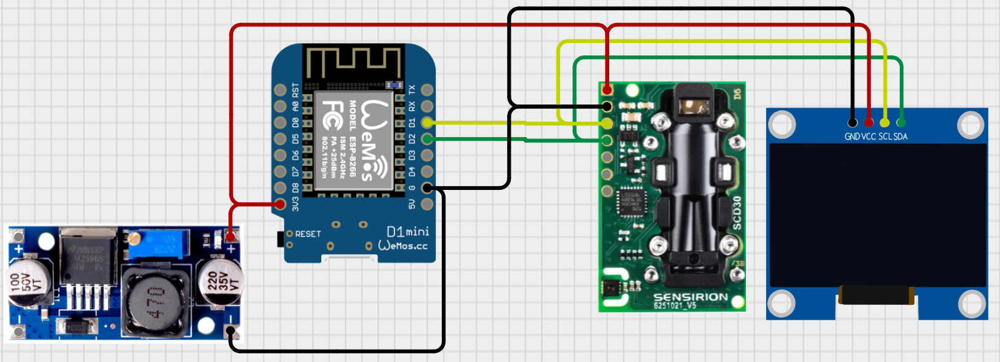

<h1>D1 mini + SCD30 CO₂ Monitor (ESP8266) — OLED + Web + UDP</h1>

A tiny CO₂ monitor for <strong>Wemos/LOLIN D1 mini (ESP8266)</strong> + <strong>Sensirion SCD30</strong> with a <strong>128×64 SSD1309 OLED</strong>. 
It provides a dark-mode web UI (with WiFiManager captive portal), a live brightness slider, and UDP telemetry/controls.

<h2>Used hardware</h2>
<ul>
  <li><strong>Wemos/LOLIN D1 mini (ESP8266)</strong></li>
  <li><strong>Sensirion SCD30</strong> CO₂ / Temperature / Humidity sensor (I²C)</li>
  <li><strong>128×64 OLED</strong>, monochrome, <strong>SSD1309</strong> controller (I²C)</li>
  <li><em>Optional:</em> <strong>LM2596</strong> buck/step-down converter (if powering from &gt;3.3&nbsp;V)</li>
</ul>

<strong>Input voltage:</strong> 3.3&nbsp;V (logic).

<h2>Wiring</h2>
<pre><code>docs/wiring.png
</code></pre>

<h2>Required libraries (Arduino Library Manager)</h2>
<ul>
  <li><strong>WiFiManager</strong> (tzapu)</li>
  <li><strong>SparkFun SCD30 Arduino Library</strong></li>
  <li><strong>U8g2</strong> (olikraus)</li>
  <li><strong>ArduinoJson v6+</strong> (Benoit Blanchon)</li>
  <li><strong>LittleFS</strong> (bundled with ESP8266 core) for config storage</li>
</ul>

<h2>ESP8266 board support (Boards Manager URL)</h2>

In <em>Arduino IDE → Preferences → Additional Boards Manager URLs</em>, add:

<pre><code>https://arduino.esp8266.com/stable/package_esp8266com_index.json
</code></pre>

Then open <em>Tools → Board → Boards Manager…</em>, search for <strong>ESP8266 by ESP8266 Community</strong>, and install.

<h2>Functionality breakdown</h2>
<ul>
  <li><strong>Wi-Fi setup:</strong> WiFiManager captive portal (AP <code>D1Mini-Setup</code>) for first-time configuration; then auto-reconnect.</li>
  <li><strong>Web UI (dark mode):</strong>
    <ul>
      <li>Status card (IP, configured UDP target and ports).</li>
      <li><strong>Brightness slider (0–100)</strong> — RAM-only; <strong>0 turns the OLED off</strong> (power-save). Resets to <strong>0</strong> on reboot.</li>
      <li>Settings to set:
        <ul>
          <li><strong>UDP target IP &amp; port</strong> (telemetry)</li>
          <li><strong>UDP listen port</strong> (brightness control)</li>
        </ul>
      </li>
    </ul>
  </li>
  <li><strong>UDP telemetry (sender):</strong> three small packets:
    <ul>
      <li><code>T</code> + temperature (°C)</li>
      <li><code>H</code> + humidity (%RH)</li>
      <li><code>C</code> + CO₂ (ppm)</li>
    </ul>
  </li>
  <li><strong>UDP brightness (receiver):</strong> listens on the configured port; accepts either:
    <ul>
      <li>ASCII integers <code>0..100</code> (e.g., <code>"42"</code>)</li>
      <li>single-byte binary values <code>0..100</code></li>
    </ul>
  </li>
  <li><strong>OLED display:</strong> large numeric CO₂ readout (ppm) for readability at distance.</li>
  <li><strong>Config persistence:</strong> UDP target + ports saved in <strong>LittleFS</strong> (<code>/config.json</code>). 
      <em>Brightness is RAM-only to avoid flash wear; not persisted across resets.</em>
  </li>
</ul>

<h2>Build &amp; flash</h2>
<ol>
  <li>Install <strong>ESP8266 board support</strong> (see Boards Manager URL above).</li>
  <li>Install the <strong>Required libraries</strong> via Library Manager.</li>
  <li>Select <strong>Board:</strong> <code>LOLIN(WEMOS) D1 R2 &amp; mini</code>.</li>
  <li>Open the sketch, verify the <strong>U8g2 constructor</strong> matches your OLED. 
      (SSD1309 is enabled by default; if you use SSD1306, switch the constructor.)</li>
  <li>Upload.</li>
</ol>

<h2>First run</h2>
<ol>
  <li>On boot, the device starts an AP <strong>D1Mini-Setup</strong> (password <code>config123</code>) if it can’t join Wi-Fi.</li>
  <li>Visit <code>http://192.168.4.1/</code> to configure Wi-Fi (captive portal).</li>
  <li>After connecting to your network, open the device’s IP to access the web UI.</li>
</ol>

<h2>UDP details</h2>
<ul>
  <li><strong>Telemetry target:</strong> configurable via web UI (IP + port).</li>
  <li><strong>Packets:</strong> three separate UDP packets labeled <code>T</code>, <code>H</code>, and <code>C</code> (ASCII payload).</li>
  <li><strong>Brightness control:</strong> send UDP to the <em>listen port</em> with value <code>0..100</code>:
    <ul>
      <li>ASCII: <code>"0"</code>, <code>"25"</code>, <code>"100"</code></li>
      <li>Binary: single byte <code>0..100</code></li>
      <li><code>0</code> turns the display <strong>OFF</strong> (power-save); <code>&gt;0</code> maps to OLED contrast.</li>
    </ul>
  </li>
</ul>

<h2>Credits</h2>
<ul>
  <li>ESP8266 Arduino Core (ESP8266 Community)</li>
  <li>WiFiManager (tzapu)</li>
  <li>U8g2 (olikraus)</li>
  <li>ArduinoJson (B. Blanchon)</li>
  <li>SparkFun SCD30 library</li>
</ul>
